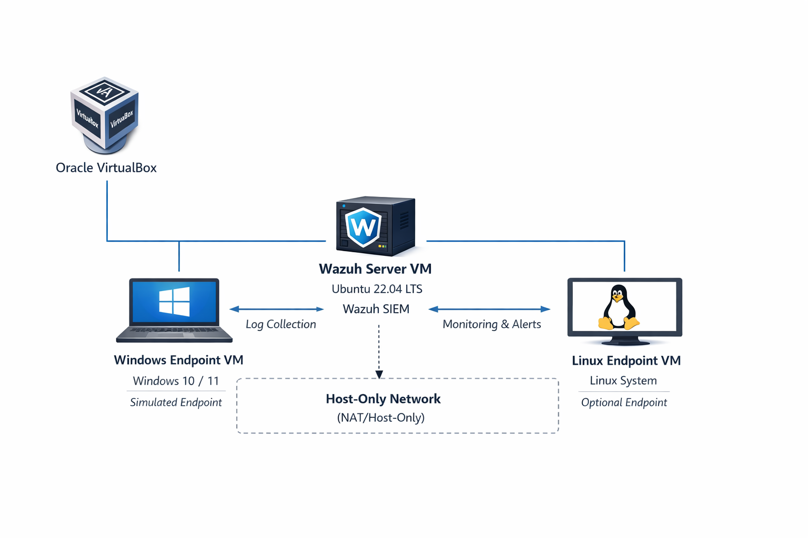

# Endpoint Detection Validation & Investigation Lab

## Overview
This project is a blue-team lab designed to simulate a realistic endpoint detection and investigation workflow using a Windows endpoint, a Wazuh server, and supporting telemetry sources.

## Project Goals
- Build a realistic endpoint-focused blue-team lab
- Validate detections against simulated suspicious activity
- Investigate endpoint telemetry and document findings
- Create recruiter-visible proof of analyst and security engineering skills

## Planned Lab Components
- Wazuh server
- Windows endpoint
- Optional Linux endpoint
- VirtualBox-based isolated network
- Sysmon and endpoint telemetry
- Detection validation scenarios
- Investigation notes and screenshots

## Architecture Overview

Initial architecture design showing endpoint, server, and network segmentation using NAT and host-only adapters.

## Repository Structure
- docs/
- screenshots/
- notes/
- architecture/
- configs/